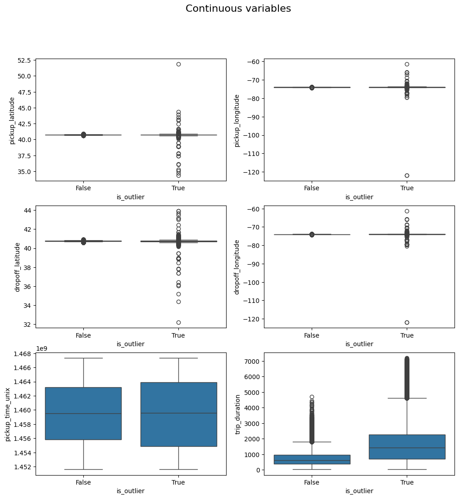
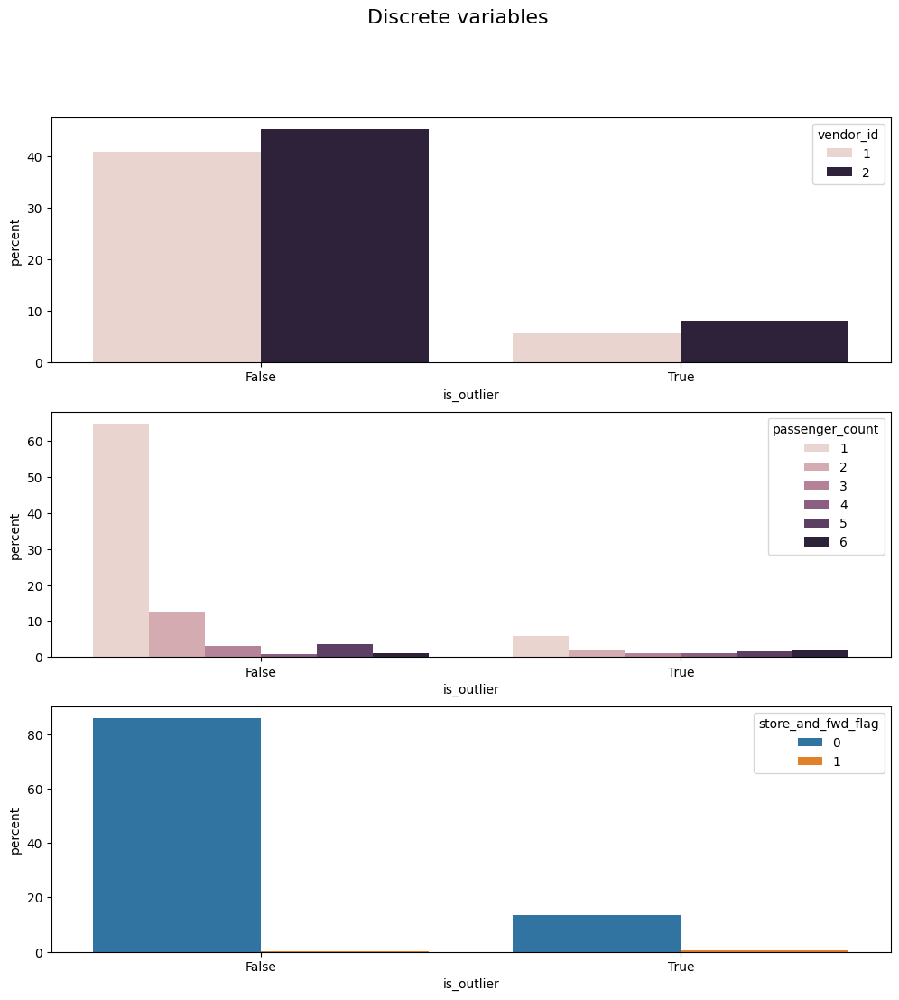
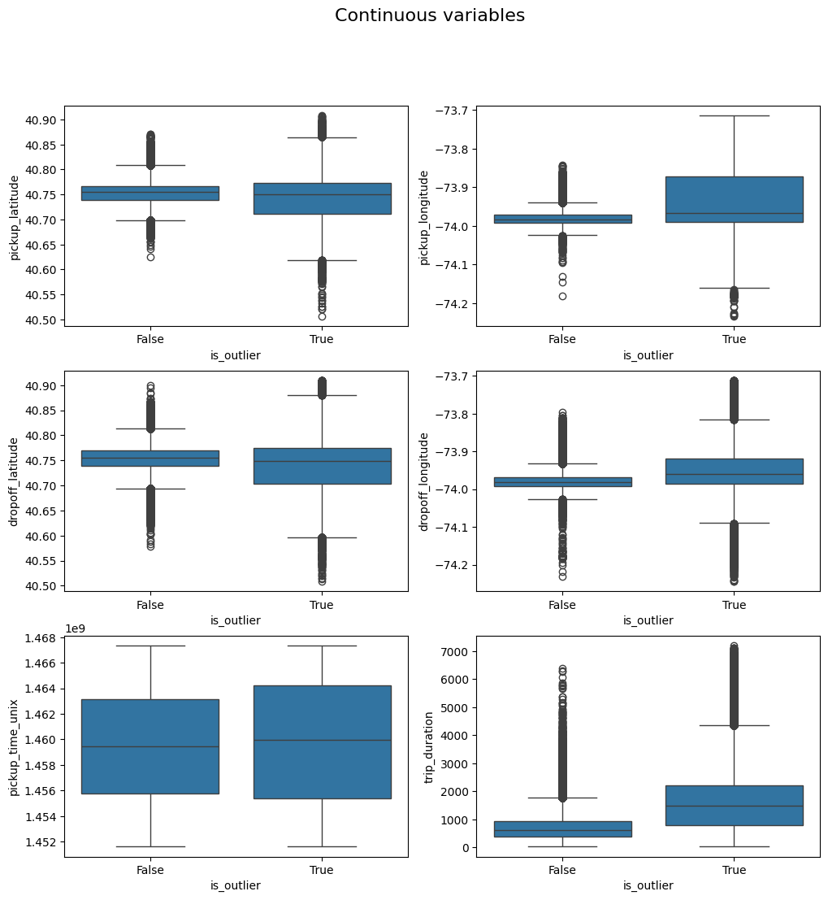
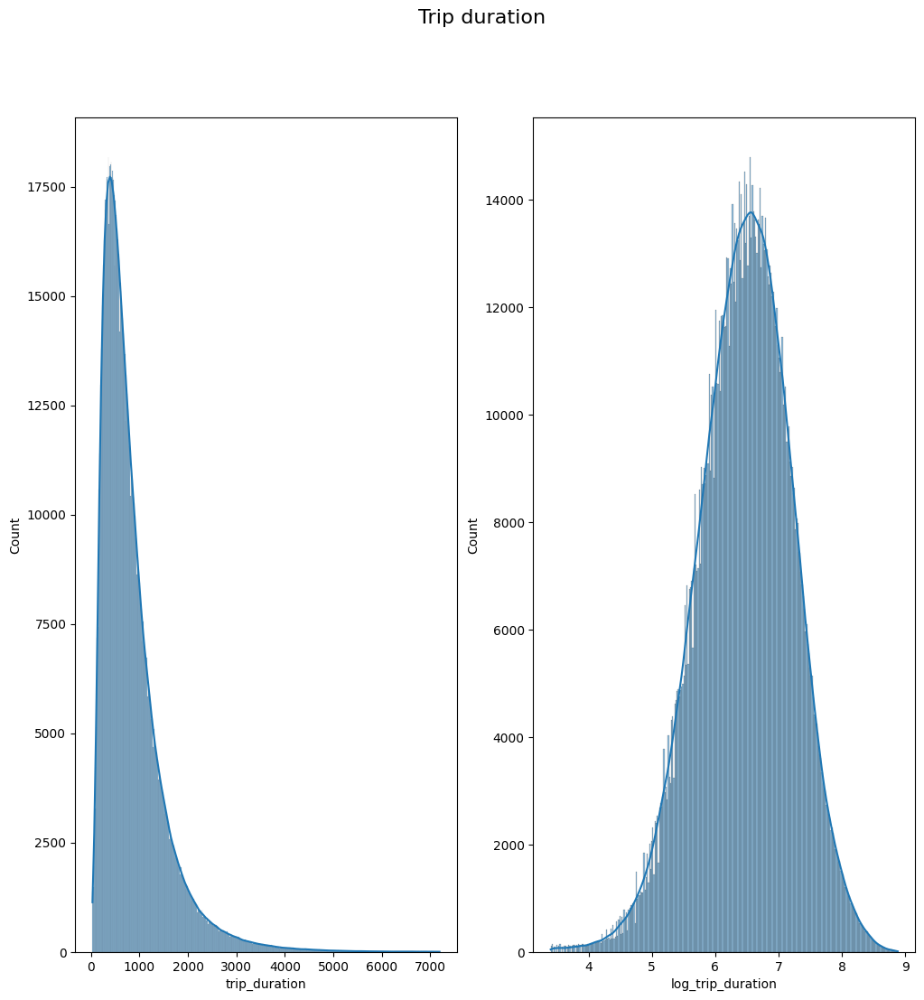
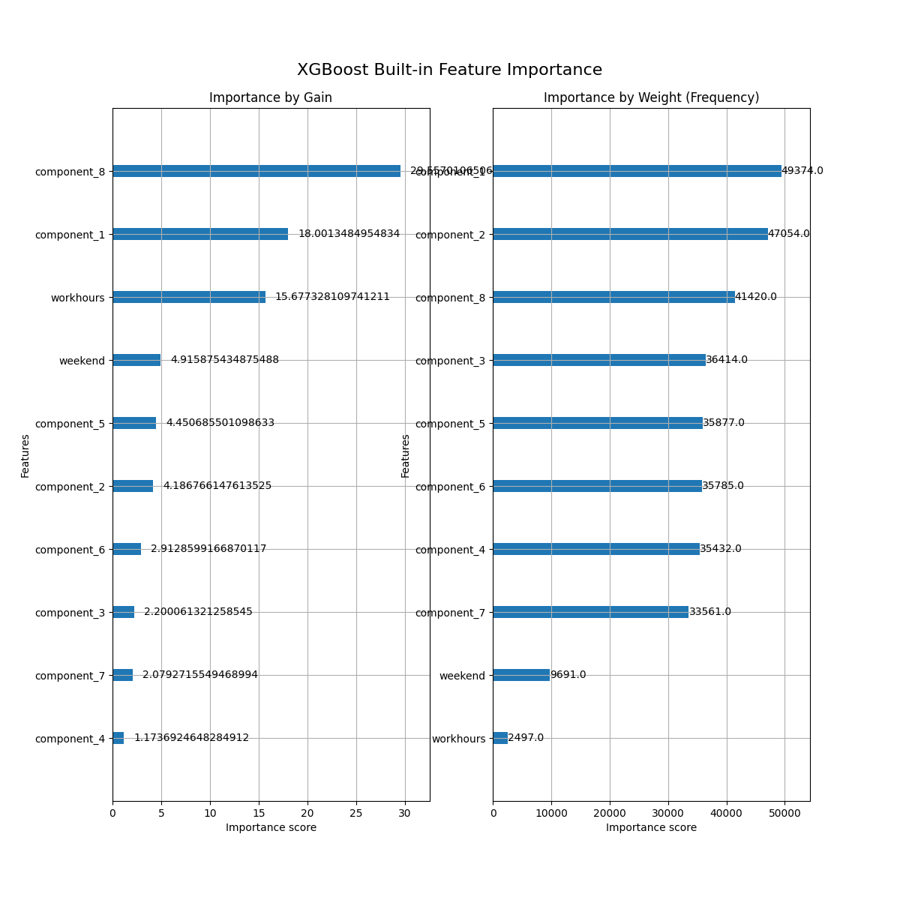
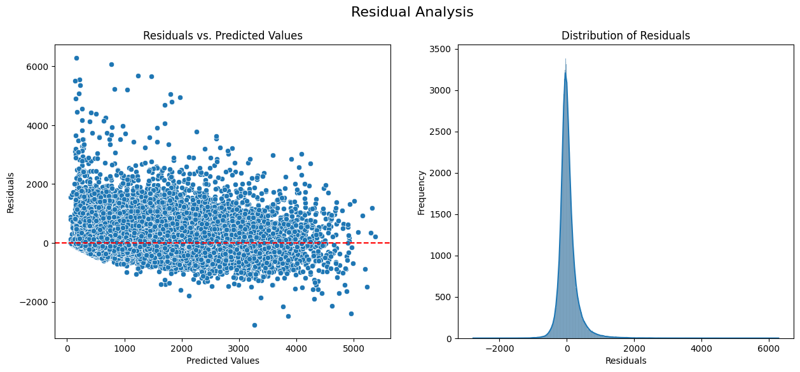
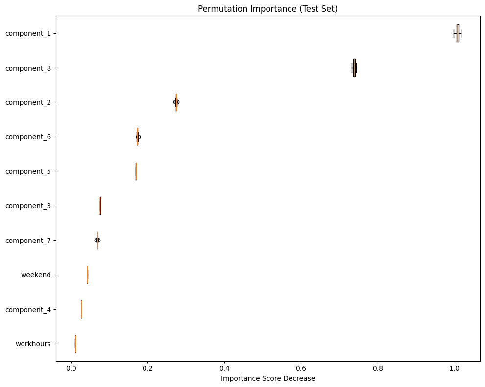

## ΔΜΠΣ: Μαθηματική Προτυποποίηση σε Σύγχρονες Τεχνολογίες και τα Χρηματοοικονομικά, ΕΜΠ

|           |                      |
|-----------|----------------------|
| Όνομα     | Χαράλαμπος Μπεκιάρης |
| ΑΜ        | 09324014             |
| email     | [charalbek@gmail.com](mailto:charalbek@gmail.com)   |
| Ημ/νια    | 26 Ιουνίου 2025     |
| Εξάμηνο   | 2ο                   |
| Μάθημα    | AI Hands on          |
| Εργασία   | Τελική                   |

# Συνοπτικά
## Οδηγίες εγκατάστασης
Τα απαραίτητα πακέτα για την εκτέλεση του προγράμματος αναφέρονται στο αρχείο requirements.txt, και μπορούν για παράδειγμα να εγκατασταθούν με την εντολή:
```bash
pip install -r requirements.txt
```

# Οδηγίες εκτέλεσης
## Βασική Χρήση
Η εφαρμογή είναι σχεδιασμένη να τρέχει καλώντας το αρχείο `main.py`, το οποίο παρέχει command line arguments. H εργασία αυτή υλοποιεί ένα deep learning tabnet μοντέλο (βλ. ενότητα 'Ζήτημα 3'), για την πρόβλεψη του χρόνου ταξιδιού μιας κούρσας ταξί. Μπορείτε να εκπαιδεύσετε το εν λόγω μοντέλο με χρήση της εντολής:
```bash
python main.py --nn
```

To μοντέλο αποθηκεύεται στην διαδρομή `models/tabnetreg.xz`. Επίσης δίνεται η δυνατότητα για tuning ορισμένων υπερπαραμέτρων, δίνοντας συμπληρωματικά το flag --tune, δηλαδή: 
```bash
python main.py --nn --tune
```

Σε αυτή την περπίπτωση, το τελικό μοντέλο αποθηκεύεται ως `models/hp_tabnetreg.xz`.

Επιπροσθέτως, μπορείτε να δοκιμάσετε να εκπαιδεύσετε ή να βρείτε κατάλληλες υπερπαραμέτρους για ένα xgboost regressor μοντέλο, χρησιμοποιώντας το αντίστοιχο flag --xgb:
```bash
python main.py --xgb (--tune)
```

Το μοντέλο αποθηκεύεται ως `models/xgbreg.pkl` και `models/hp_xgbreg.xz` αντίστοιχα. Περισσότερες πληροφορίες με το hyperparameter tuning στις παρακάτω ενότητες. 

Κλείνοντας αποφασίζουμε ότι το τελικό μοντέλο που απαντάει στα τελευταία ερωτήματα της εργασίας να είναι ένα το βελτιστοποιημένο xgboost μοντέλο.

## Endpoint (uvicorn)
Το script `app.py` υλοποιεί το endpoint `/predict` προκειμένου να αλληλεπιδράσετε με το xgboost μοντέλο και να πάρετε τις σχετικές προβλέψεις. Αρκεί να δώσετε σε json τα δεδομένα, και το μοντέλο εσωτερικά θα κάνει ό,τι preprocessing χρειάζεται πριν δώσει την τιμή πρόβλεψης.
```bash
uvicorn app:app --host 0.0.0.0 --port 8080 --reload
```

Μπορείτε να ζητήσετε από το μοντέλο να σας κάνει μία πρόβλεψη, για παράδειγμα στις πρώτες δύο γραμμές του test dataframe:
```python
import requests
import pandas as pd 
df = pd.read_csv('data/nyc-taxi-trip-duration/test_processed.csv')
url = "http://127.0.0.1:8080/predict"
json = df.iloc[:2].to_dict(orient='records')
response = requests.post(url, json=json)
print(response.text)  # {"predictions":[756.30859375,337.8510437011719]}
print(df.iloc[0:2]['trip_duration'].tolist())  # [679.0, 344.0]
```

## Containerization
Το /predict endpoint μπορεί να γίνει deploy από docker container, αρκεί να φτιάξετε ένα container image όπως περιγράφει το Dockerfile που βρίσκεται στο root directory του project, με την εντολή:
```console
docker build --tag 'bekiaris_final' .  --no-cache
```
Στην συνέχεια μπορείτε ενα εκκινήσετε το container:
```console
docker run -dit -p 8080:8080 --name bekiaris bekiaris_final:latest
```
Η παραπάνω εντολή θα φτιάξει ένα container με το όνομα `bekiaris` χρησιμοποιώντας το `bekiaris_final` docker image και θα κάνει expose την θύρα 8080 στην οποία ακούει το uvicorn app.
# Ζήτημα 1: Επιλογή dataset & task

Στις προηγούμενες εργασίες είχε επιλεχθεί η επίλυση ενός regression task. Συνεπώς και σε αυτή την εργασία θα ασχοληθούμε με ένα πρόβλημα παλινδρόμησης. Το dataset που επιλέχθηκε, είναι το [nyc-taxi-trip-duration](https://www.kaggle.com/competitions/nyc-taxi-trip-duration/data) από διαγωνισμό του kaggle. Στόχος του dataset είναι να γίνει πρόβλεψη της διάρκειας μιας διαδρομής ταξί στην πόλη της Νέας Υόρκης. Τα features του dataset είναι τα εξής:

- id : Μοναδικό αναγνωριστικό της κάθε διαδρομής.
- vendor_id: Το αναγνωριστικό της εταιρίας η οποία παρέχει τα δεδομένα.
- pickup_datetime: Η ημερομηνία - αφετηρία της διαδρομής.
- dropoff_datetime: Η ημερομηνία άφιξης στον προορισμό.
- passenger_count: Το πλήθος των επιβατών.
- pickup_longitude: Το γεωγραφικό μήκος του σημείου αφετηρίας.
- pickup_latitude:  Το γεωγραφικό πλάτος του σημείου αφετηρίας.
- dropoff_longitude:  Το γεωγραφικό μήκος του σημείου προορισμού.
- dropoff_latitude:  Το γεωγραφικό πλάτος του σημείου προορισμού.
- store_and_fwd_flag: Αν το τακί είχε σύνδεση στο διαδίκτυο ή τα δεδομένα εισήχθησαν σε μεταγενέστερο χρόνο στον σέρβερ.
- trip_duration: Η διάρκεια του ταξιδιού σε δευτερόλεπτα.

# Ζήτημα 2: Προεπεξεργασία δεδομένων
## Καθαρισμός, προεπεξεργασία και διαχωρισμός

Τρέχουμε το αρχείο:
```console
python feature_engineering/main.py
```
 Από την κονσόλα, παρατηρούμε τα εξής:

- Τα δεδομένα έρχοντα ήδη χωρισμένα σε δύο αρχεία, train και test. Η αναλογία του train-test είναι 70.00% και τα δεδομένα συνολικά είναι περίπου 2 εκατομμύρια.
```
Train data points: 1458644
Total data points: 2083778
Train ratio: 70.00%
```

- Τα δεδομένα έχουν 625 χιλιάδες εγγραφές στις οποίες λείπει η τιμή της μεταβλητής απόκρισης `trip_duration` και κατ' επέκταση η αντίστοιχη ημερομηνία άφιξης `dropoff_datetime`. Η απουσία και των δύο είναι δικαιολογημένη, καθώς η διάρκεια της διαδρομής προκύπτει ως αφαίρεση της ημερομηνίας αφίξης με την ημερομηνία εκκίνησης.  Ο λόγος που απουσιάζουν είναι λόγω της φύσης του διαγωνισμού από τον οποίο προέκυψαν τα δεδομένα, όπου τα "test" δεδομένα δεν έχουν τιμή στην μεταβλητή απόκρισης, προκειμένου οι χρήστες να κάνουν submit στο kaggle τα αντίστοιχα predictions και να βαθμολογηθούν, Επομένως, για τους σκοπούς αυτής της άσκησης, θα ασχοληθούμε μόνο με τα train δεδομένα, όπου γενικά δεν υπάρχουν missing values σε κάποιο άλλο feature.
```
Nan values:
id                         0
vendor_id                  0
pickup_datetime            0
dropoff_datetime      625134
passenger_count            0
pickup_longitude           0
pickup_latitude            0
dropoff_longitude          0
dropoff_latitude           0
store_and_fwd_flag         0
trip_duration         625134
is_train                   0
```

- Για να αντιμετωπίσουμε ανώμαλες τιμές, αρχικά εξετάζουμε ορισμένα features των δεδομένων.
- Trip duration: εξετάζουμε διαδρομές με πολύ μικρή ή πολύ μεγάλη διάρκεια. Απορρίπτουμε διαδρομές με διάρκεια μικρότερη του μισού λεπτού και μεγαλύτερη των 2 ωρών
```
Rides over 1 hours: 12317
Rides over 2 hours: 2253
Rides over 3 hours: 2112
Rides over 4 hours: 2077
Rides over 5 hours: 2072
Rides over 6 hours: 2061
Rides over 7 hours: 2050
Rides under 0.5 minutes: 4782
Rides under 1.0 minutes: 8595
Rides under 1.5 minutes: 15450
Rides under 2.0 minutes: 27817
Rides under 2.5 minutes: 46394
Total datapoints before filtering duration: 1458644
Total datapoints after filtering duration: 1451609
```
- Passengers:  Ελέγχουμε πόσες κούρσες πραγματοποιήθηκαν ανά κατηγορία/πλήθος επιβατών. Οι διαδρομές με 8 και 9 επιβάτες αντίστοιχα, είναι μόλις 2, επομένως θεωρούμε ότι δεν έχουν αντιπροσωπευτικό μερίδιο και τις πετάμε από τα δεδομένα. Επίσης, υπάρχουν 24 διαδρομές με 0 επιβάτες, το οποίο προφανώς είναι σφάλμα, και τους αλλάζουμε το πλήθος επιβατών σε 1 (πλειοψηφική κατηγορία).
```
Taxi rides with 0 passengers : 24
Taxi rides with 1 passengers : 1028249
Taxi rides with 2 passengers : 209514
Taxi rides with 3 passengers : 59662
Taxi rides with 4 passengers : 28288
Taxi rides with 5 passengers : 77731
Taxi rides with 6 passengers : 48139
Taxi rides with 8 passengers : 1
Taxi rides with 9 passengers : 1
```
- Outliers detection: Για την ανίχνευση σημείων μόχλευσης/έκτροπων τιμών αρχικά κάνουμε fit ένα isolation forest. Προκειμένου να συμπεριλάβουμε στην μελέτη και την ημερομηνία αφετηρίας (pickup_datetime), η οποία είναι σε μορφή `%Y-%m-%d %H:%M:%S`, εξάγουμε ένα αριθμητικό feature που είναι ο αντίστοιχος unix χρόνος (`pickup_time_unix`). Ακολούθως, γίνονται διαγράμματα ανάμεσα στα detected outliers και inliners:


Το παραπάνω διάγραμμα των συνεχών μεταβλητών, δείχνει ότι στις μεταβλητές με συντεταγμένες, έχουν κατηγοριοποιηθεί ως outiliers αρκετές παρατηρήσεις οι οποίες ενδέχεται να αναφέρονται σε σημεία εκτός της Νέας Υόρκης. Για την μεταβλητή απόκρισης, `trip_duration` , αξίζει να σημειωθεί πως το θηκοδιάγραμμα υποδηλώνει πως ακολουθεί κατανομή lognormal, και ίσως να μπορούσαμε να την λογαριθμήσουμε ώστε να έχει κανονική κατανομή.


Το διάγραμμα των διακριτών μεταβλητών δεν φανερώνει κάτι ανησυχητικό ανάμεσα στα δύο groups.

- Αποφασίζουμε να φιλτράρουμε τις γεωγραφικές συντεταγμένες. Αξιοποιώντας [αυτή την πηγή](https://data.cityofnewyork.us/City-Government/Digital-City-Map-Shapefile/m2vu-mgzw) μπορούμε να έχουμε τις συντεταγμένες για κάθε γειτονιά της Νέας Υόρκης. Λαμβάνοντας υπόψιν τα μέγιστα και ελάχιστα γεωγραφικά μήκη/πλάτη μπορούμε να ορίσουμε ένα τετράγωνο της περιοχής:


Πετάμε από το dataset τις διαδρομές με αφετηρία/προορισμό εκτός του ορθογωνίου:
```
Datapoints before dropping rides outside NYC: 1451607
Datapoints after dropping rides outside NYC: 1450148
```
... και επαναλαμβάνουμε τα θηκοδιαγράμματα των ποσοτικών μεταβλητών



Τα θηκοδιαγράμματα φαίνεται να είναι πιο φυσιολογικά, και ενώ υπάρχουν ποιοτικές διαφορές στις κατανομές των inliners και outliers, παραμένουν κοντά τα θηκοδιαγράμματα των εν λόγω κατηγοριών.

- Κλείνοντας, κάνουμε finalize το κομμάτι του outlier detection, κάνοντας fit ένα isolation forest και έναν SGD One Class SVM. Στον τελευταίο, τυποιούμε τις μεταβλητές εισόδου καθώς είναι ευαίσθητος στον scaling των μεταβλητών.
```
Isolation forest outliers: 185188
SGD OneClass SVM outliers: 80121
Common outliers: 2004
```
Το Isolation forest εχει ανιχνεύσει αρκετές παραπάνω παρατηρήσεις ως outliers. Οι δύο τεχνικές συμφωνούν σε μόλις 2,004 παρατηρήσεις, και αποφασίζουμε ότι εφόσων συμπίπτουν μπορούμε να τις αφαιρέσουμε:
```
Data points after dropping common outliers: 1448144
```

Το τελικό dataset έπειτα από αυτή την μελέτη είναι μικρότερο κατά μόλις 10,000 παρατηρήσεις σε σχέση με το αρχικό. <ins>Χωρίζουμε τα δεδομένα σε 90% (train & val μαζί) και 10% test</ins>. Τα αντίστοιχα dataset αποθηκεύονται ως `train_processed.csv` και `test_processed.csv` στον φάκελο `data/nyc-taxi-trip-duration`.

Επίσης κατασκευάζουμε ένα διάγραμμα σχετικά με την υποψία ότι η μεταβλητή απόκρισης είναι log-normal:



Πράγματι, η λογαριθμισμένη διάρκεια ταξιδιού φαίνεται να ακολουθεί κανονική κατανομή. Άρα, με βάση και τα προηγούμενα, γραφικά φαίνεται να ταιριάζει στα δεδομένα η τυποποιήση, και <ins>επιλέγουμε να τυποποιούμε τις αριθμητικές μεταβλητές, ενώ τα μοντέλα εκπαιδεύονται μαθαίνοντας την log(trip_duration), και οι μετρικές που θα χρησιμοποιούνται θα υπολογίζονται με exp(y_pred), δηλαδή στην αρχική κλίμακα.</ins>

## Feature Engineering
### Combine & extract features
Για την μελέτη των νέων μεταβλητών που θέλουμε να εισάγουμε, τρέχουμε το script `feature_engineering/feature_engineering.py`. Tο script αυτό δοκιμάζει τα νέα features πραγματοποιώντας 4-Fold cross validation στο `train_processed.csv` με την βοήθεια ενός xgboost regressor από το πακέτο xgboost. Τα εν λόγω features που θέλουμε να εξετάσουμε είναι τα εξής:

- **pickup_time_unix**: Εξάγουμε από την μεταβλητή `pickup_time`  τον χρόνο σε unix format, ένα αριθμητικό δηλαδή feature το οποίο εμπεριέχει την ημέρα, ημερομηνία, έτος καθώς και την ώρα έναρξης της διαδρομής.

- **weekend**: Εξάγουμε από την μεταβλητή `pickup_time`  μία δυαδική μεταβλητή 1: Η διαδρομή έγινε Σαββατοκύριακο, 0: Αλλιώς.

- **workhours**: Εξάγουμε από την μεταβλητή `pickup_time`  μία δυαδική μεταβλητή 1: Η διαδρομή έγινε μεταξύ 09:00 - 17:00, 0: Αλλιώς.

- **haversine**:  Συνδυάζουμε τα pickup και dropoff longitude/latitude προκειμένου να εξάγουμε την απόσταση (σε χιλιόμετρα) της διαδρομής αξιοποιώντας τον τύπο [haversine](https://www.geeksforgeeks.org/dsa/haversine-formula-to-find-distance-between-two-points-on-a-sphere/).

- **sin_hour και cos_hour**:  Εξάγουμε δύο αριθμητικές μεταβλητές από την ώρα αφετηρίας, συγκεκριμένα  αναλύουμε την ώρα σε ένα ημιτονοειδές και ένα συνημιτονοειδές component. Παρότι είναι δύο features, εξετάζουμε την επιρροή τους όταν βρίσκονται ταυτόχρονα στο μοντέλο.

Τα αποτελέσμα συνοψίζονται στον ακόλουθο πίνακα που εμφανίζεται στην κονσόλα όταν τρέξουμε το script:
```
|    | feature           |   mse_mean |   mse_std |
|---:|:------------------|-----------:|----------:|
|  0 | baseline          |     133564 |   415.388 |
|  1 | unix_time         |     118923 |   305.359 |
|  2 | weekend           |     129060 |   332.643 |
|  3 | workhours         |     119801 |   493.855 |
|  4 | haversine         |     130332 |   321.724 |
|  5 | sin_hour~cos_hour |     103980 |   605.263 |
```
To baseline xgboost μοντέλο (δίχως την προσθήκη κάποιας εκ των νέων μεταβλητών) έχει το μεγαλύτερο μέσο τετραγωνικό σφάλμα (μέση τιμή στα 4 folds). Εν αντιθέσει, η αποσύνθεση της ώρας σε συνιμοτονειδές και ημιτονοειδές συστατικά έδωσε την μεγαλύτερη βελτίωση, αν και η τυπική απόκλιση της εν λόγω μετρικής έχει αυξηθεί σε σχέση με το baseline model, αλλά εξακολουθεί να είναι αρκετά μικρή. Εν γένει όλα τα features βελτίωσαν την απόδοση του μοντέλου, και ειδικά εκείνα που σχετίζονται με τον χρόνο. Το νέο χαρακτηριστικό της haversine απόστασης έδωσε την μικρότερη βελτίωση, ενώ αναμέναμε η εξαγωγή της χιλιομετρικής απόστασσης να είχε συμβάλλει περισσότερο στην μείωση του σφάλματος. Ενδεχομένως οι συντεταγμένες από μόνες τους στο xgboost μοντέλο να συνδιάζονται με τέτοιο τρόπο ώστε να υποδεικνύουν γειτονιές με αυξημένη κίνηση και κατ επέκταση μεγαλύτερο χρόνο διαδρομής (το οποίο δεν είναι απαραίτητο να σχετίζεται απαραίτητα μόνο από την απόσταση). 

### Feature Selection

Τρέχουμε το script:
```console
python feature_engineering/feature_selection.py
```
Το εν λόγω script εφαρμόζει στο train dataset την Select k best τεχνική για k=6 σε κάθε ένα από τα 4 folds του cross validation, και επιστρέφει τις 6 μεταβλητές με την μεγαλύτερη συχνότητα εμφάνισης στα 4 folds. Επιπροσθέτως, σε κάθε fold εκπαιδεύεται το xgboost μοντέλο και καταγράφεται η απόδοσή του (mean squared error) του validation set. Στην κονσόλα εμφανίζονται τα ακόλουθα αποτελέσματα:

```
--- Feature Selection Results ---
| method             |   mse_mean |   mse_std | selected_features_example                                                                                  |
|:-------------------|-----------:|----------:|:-----------------------------------------------------------------------------------------------------------|
| SelectKBest (k=6)  |     115951 |   485.85  | ['pickup_latitude', 'pickup_longitude', 'dropoff_latitude', 'dropoff_longitude', 'workhours', 'haversine'] |
```
Παρατηρούμε στις 6 καλύτερες περιέχονται 2 από τις μεταβλητές που προστέσαμε, και όλες όσες σχετίζονται με γεωγραφικές συντεταγμένες. Σε αυτή την περίπτωση, το μοντέλο με τις έξι μεταβλητές καταφέρνει να έχει καλύτερο μέσο τετραγωνικό σφάλμα από το baseline μοντέλο. Στην συνέχεια, το script κατασκευάζει το tree-based feature importance του xgboost μοντέλου:


- **gain**: Οι μεταβλητές `haversine` και `workhours` όταν προτάθηκαν να μπουν στο μοντέλο φαίνεται να έδωσαν την μεγαλύτερη βελτίωση στην τιμή της αντικειμενικής συνάρτησης. Την χειρότερη επίδοση είχαν οι μεταβλητές `store_and_fwd_flag` και `passenger_count`.
- **weight**: Οι μεταβλητές `haversine` και όλες οι συντεταγμένες είναι οι top βάση του συνολικού πλήθους των εμφανίσεών τους στα δέντρα. Ξανά η  `store_and_fwd_flag` φαίνεται να έχει μικρή συνεισφορά στο μοντέλο, μαζί με την `vendor_id`.

Με βάση τα παραπάνω, <ins>στα επόμενα βήματα της εργασίας αποφασίζουμε να πετάξουμε τις μεταβλητές `passenger_count`,  `store_and_fwd_flag`  και `vendor_id`</ins>

### PCA
Δοκιμάζουμε να μειώσουμε περαιτέρω την διάσταση των numeric features:
```python
[
    'pickup_latitude', 'pickup_longitude',
    'dropoff_latitude', 'dropoff_longitude',
    'unix_time', 'haversine', 'sin_hour', 'cos_hour'
]
```
εφαρμόζοντας PCA. Ο κώδικας θα πραγματοποιήσει 4-fold Cross Validation, όπου στα train folds θα γίνεται fit_transform Standard Scaler και στην συνέχεια PCA, ενώ σκέτο transform στο validation fold.  Ακολούθως, τα pca components που προκύπτουν γίνονται concatenate στις κατηγορικές μεταβλητές:
```python
[
    'weekend', 'workhours'
]
```
και τελικά εκπαιδεύεται το αντίστοιχο xgboost μοντέλο. Αυτά γίνονται εκτελώντας το script:
```console
python feature_engineering/dimensionality_reduction.py
```
Τα αποτελέσματα που εμφανίζονται στην κονσόλα είναι τα ακόλουθα:
```python
Explained variance ratio by component:
Component 1: 0.2389 (23.89%)
Component 2: 0.1842 (18.42%)
Component 3: 0.1448 (14.48%)
Component 4: 0.1250 (12.50%)
Component 5: 0.1066 (10.66%)
Component 6: 0.0874 (8.74%)
Component 7: 0.0655 (6.55%)
Component 8: 0.0476 (4.76%)
Cumulative variance explained: 100.00%
--- PCA Results ---
|   n_components |   mse_mean |   mse_std |
|---------------:|-----------:|----------:|
|              2 |   204536   |   534.054 |
|              3 |   178576   |   644.776 |
|              4 |   174750   |   668.241 |
|              5 |   145964   |   605.656 |
|              6 |   127720   |   471.515 |
|              7 |    91163.5 |   709.069 |
|              8 |    86111.6 |   538.105 |

```
Παρατηρούμε ότι τα πρώτα 4 κύρια συστατικά εξηγούν το 70% της συνολικής διασποράς. Επιπλέον, από τα μοντέλα που προσαρμόσαμε, είναι φανερό ότι αν θέλαμε να πετύχουμε επίδοση καλύτερη από το baseline μοντέλο, θα έπρεπε να διατηρήσουμε τουλάχιστον 6 κύρια συστατικά. Παρόλα αυτά, το μοντέλο που έχει διατηρήσει και τις 8 συνιστώσες, έχει σημαντικά βελτιωμένη επίδοση σε σχέση με όσα μοντέλα έχουμε εξετάσει μέχρι τώρα. 

Με βάση τα παραπάνω, <ins>στα μοντέλα που θα προσαρμοστούν στις επόμενες ενότητες, συμπληρωματικά με όλα τα παραπάνω αποφασίζουμε να εφαρμόσουμε PCA με 8 components.</ins>


# Ζήτημα 3: Machine &  Deep Learning models
To validation dataset των επόμενων ερωτημάτων έχει προκύψει ως το 11,111% του train set, για να πετύχουμε 80/10/10 split.
## Machine Learning model
Ως machine learning model, επιλέγουμε ένα xgboost model, με baseline παραμέτρους:
```python
{
    'n_estimators': 500,
    'max_depth': 6,
    'reg_alpha': 0,
    'reg_lambda': 1,
    'learning_rate': 0.3,
}
```
Εφαρμόζουμε Early Stopping strategy με patience=10 και μετρική παρακολούθησης στο validation dataset τον δείκτη R2.
Το performance του baseline xgboost μοντέλου είναι το ακόλουθο:
```python
|       |       R2 |     MAPE |    RMSE |     MSE |
|:------|---------:|---------:|--------:|--------:|
| train | 0.808049 | 0.25098  | 284.812 | 81117.8 |
| val   | 0.799509 | 0.263148 | 289.455 | 83784.4 |
| test  | 0.793695 | 0.262553 | 294.816 | 86916.4 |
```
Όλες οι μετρικές είναι πολύ κοντά ανεξαρτήτου data set (train. test ή validation). Ο δείκτης R2 είναι πολύ κοντά στο 80%, το οποίο δείχνει ικανοποιητική συσχέτιση μεταξύ των προβλέψεων και των πραγματικών τιμών. Επιπλέον, η τιμή του μέσου τετραγωνικού σφάλματος, ακόμα και στα unseen (μέχρι πρότινος) test data είναι στα επίπεδα που αναμέναμε από μελέτες σε προηγούμενα ερωτήματα. Συνεπώς το εν λόγω μοντέλο αποτελεί μια καλή αφετηρία. Στην συνέχεια πραγματοποιούμε grid search για τον καλύτερο συνδιασμό των παραμέτρων:
```python
{
	'max_depth': [2, 5, 10],
	'learning_rate': [1e-01, 1e-02, 1e-03],
	'n_estimators': [500, 750],
	'reg_alpha': [0.01, 0.1, 0],
	'reg_lambda': [0.01, 0.1, 0],
}
```
Οι καλύτερες παράμετροι (βάση του validation set) που προέκυψαν είναι οι ακόλουθοι:
```python
{
	'n_estimators': 500, 
	'max_depth': 10,
	'reg_alpha': 0.1, 
	'reg_lambda': 0,
	'learning_rate': 0.1,
}
```
Με επίδοση:
```python
|       |       R2 |     MAPE |    RMSE |     MSE |
|:------|---------:|---------:|--------:|--------:|
| train | 0.854853 | 0.211816 | 247.666 | 61338.4 |
| val   | 0.81336  | 0.251786 | 279.278 | 77996.2 |
| test  | 0.806324 | 0.250923 | 285.65  | 81596   |
```
Το μοντέλο παρουσιάζει σημαντικά καλύτερη επίδοση στο train set σε σχέση με το baseline. Ελαφρώς βελτιωμένες είναι και οι μετρικές στα validation & test datasets. Υπάρχει μια μικρή ένδειξη ότι αρχίζει να γίνεται overfit, αλλά από την στιγμή πού όλες οι μετρικές είναι βελτιωμένες (ακόμα και στο test set), μπορούμε να το αποδεχτούμε.

## Deep Learning model
Ως deep learning model, επιλέγουμε το [TabNet](https://arxiv.org/pdf/1908.07442) model από το πακέτο [pytorch-tabnet](https://github.com/dreamquark-ai/tabnet), με baseline παραμέτρους (defaults):
```python
{
	"n_d": 8,
	"gamma": 1.3,
	"n_shared": 2,
	"lambda_sparse": 1e-3,
}
```
Εφαρμόζουμε Early Stopping strategy με patience=3, μετρική παρακολούθησης στο validation dataset τον δείκτη R2 και το πολύ 20 εποχές εκπαίδευσης. Το performance του baseline tabnet μοντέλου είναι το ακόλουθο:
```python
|       |       R2 |     MAPE |    RMSE |     MSE |
|:------|---------:|---------:|--------:|--------:|
| train | 0.767008 | 0.269347 | 313.786 | 98461.5 |
| val   | 0.773163 | 0.269527 | 307.886 | 94794.1 |
| test  | 0.7658   | 0.269602 | 314.116 | 98668.6 |
```
Όλες οι μετρικές είναι πολύ κοντά ανεξαρτήτου data set (train. test ή validation). Ο δείκτης R2 είναι πολύ κοντά στο 77%, ελαφρώς χειρότερος σε σχέση με το xgboost μοντέλο. Το ίδιο ισχύει και για την τιμή του μέσου τετραγωνικού σφάλματος, η οποία είναι τουλ. 10,000 μονάδες χειρότερη από το αρχικό xgboost μοντέλο. Στην συνέχεια πραγματοποιούμε grid search για να βρούμε τον καλύτερο συνδιασμό των παραμέτρων:
```python
{
	"n_d": [8, 16, 32],
	"gamma": [1.3, 1.7],
	"n_shared": [2, 4],
	"lambda_sparse": [1e-3, 1e-4],
}
```
Οι καλύτερες παράμετροι (βάση του validation set) που προέκυψαν είναι οι ακόλουθοι:
```python
{
	'n_d': 32,
	'gamma': 1.3,
	'n_shared': 4, 
	'lambda_sparse': 0.0001
 }
```
Με επίδοση:
```python
|       |       R2 |     MAPE |    RMSE |     MSE |
|:------|---------:|---------:|--------:|--------:|
| train | 0.795545 | 0.262082 | 293.942 | 86402.1 |
| val   | 0.800323 | 0.263031 | 288.867 | 83444.2 |
| test  | 0.791435 | 0.263785 | 296.427 | 87868.8 |
```
Το βελτιστοποιημένο μοντέλο είναι σημαντικά καλύτερο από το αρχικό. Υπάρχει σημαντική βελτίωση στον δείκτη R2 (+3%) και του MAPE (-0.7%). Καταφέραμε να βελτιώσουμε το μέσο τετραγωνικό σφάλμα, κατά 10,000 μονάδες, και το μοντέλο που προέκυψε έχει πολύ κοντινές μετρικές σε όλα τα data sets (train/test/validation). Συνεπώς είμαστε ικανοποιημένοι από την ικανότητα γενίκευσης του μοντέλου και την βελτίωση στην απόδοση.


## Final Model
Ως τελικό μοντέλο συγκρίνοντας το βελτιστοποιημένο xgboost και tabnet μοντέλο, επιλέγουμε το xgboost. Η απόφαση προκύπτει από το μικρό υπολογιστικό κόστος και την καλύτερη επίδοση του xgboost στο test set. Η εκπαίδευση του tabnet χρειάζεται 1 λεπτό ανά epoch, δηλαδή το πολύ 20 λεπτά για 20 εποχές. Εν αντιθέσει, το xgboost σε ένα μόλις λεπτό έχει ολοκληρώσει την διαδικασία εκπαίδευσης και τα αποτελέσματα είναι καλύτερα. Πιο συγκεκριμένα, ο δείκτης R2 στο test set είναι +1.5%, το MAPE -1.2% και υπάρχει επίσης σημαντική διαφορά στα MSE και RMSE. 

# Ζήτημα 4: Model Interpretation
Σχετικά με το performance του μοντέλου, οι διάφορες μετρικές που χρησιμοποιήθηκαν σχολιάστηκαν στο προηγούμενο ερώτημα. Για την κατανόηση τις συμπεριφοράς του τελικού μοντέλου, φτιάχνουμε κάποια διαγράμματα τρέχοντας το script:
```console
python models/model_interpretation.py
```
Τα διαγράμματα σώζονται στον φάκελο `models/plots` και παρουσιάζονται ακολούθως.

## Feature importance


- **gain**: Το 1ο και 8ο component φαίνεται να έδωσαν την μεγαλύτερη βελτίωση στην τιμή του σφάλματος, όταν εισήχθησαν στο μοντέλο. Αμέσως μετά ακολουθούν οι δυαδικές μεταβλητές  `workhours` και `weekend `, οι οποίες από το  **weight** plot φαίνεται να μην έχουν μεγάλη συμμετοχή, ωστόσο η παρουσία τους φαίνεται να είναι σημαντική.
- **weight**: Το 1ο και 2o component είναι τα top-2 features της PCA που έχουν το μεγαλύτερο ποσοστό της διασποράς. Φαίνεται το μοντέλο να τα αξιοποιεί καθώς τα εν λόγω features επιλέχθηκαν συχνά στα επιμέρους δέντρα. 
## Residuals plot


Το διάγραμμα των residuals vs predicted values φανερώνει μια τάση ότι στις διαδρομές που προβλέπεται χαμηλός χρόνος, το σφάλμα είναι μεγαλύτερο. Καθώς μεγαλώνει η προβλεπόμενη τιμή του χρόνου της διαδρομής, τα σφάλματα μειώνονται. Παρόλα αυτά τα σφάλματα είναι κοντά στο μηδέν και δεν φαίνεται να παραβιάζεται η υπόθεση της ομοσκεδαστικότητας. Επιπλέον, το ιστόγραμμα των σφαλμάτων επίσης επιβεβαιώνει ότι θα μπορούσε να κατανέμονται κανονικά, και κεντραρισμένα γύρω από το μηδέν. 

## Permutation importance


Γενικά τα θηκοδιαγράμματα φαίνεται να έχουν μικρό εύρος το οποίο δείχνει συνέπεια του μοντέλου. Όπως ήταν αναμενόμενο, την μεγαλύτερη επίδραση έχει το πρώτο κύριο συστατικό, το οποίο εξηγεί μεγάλο μέρος της διασποράς των numeric χαρακτηριστικών. Περιέργως, και εδώ το 8ο component φαίνεται να έχει μεγάλη επιρροή, ενώ τα αποτελέσματα  συμφωνούν με το feature importance plot και στο κομμάτι της επιρροής των `workhours` και `weekend ` μεταβλητών.
